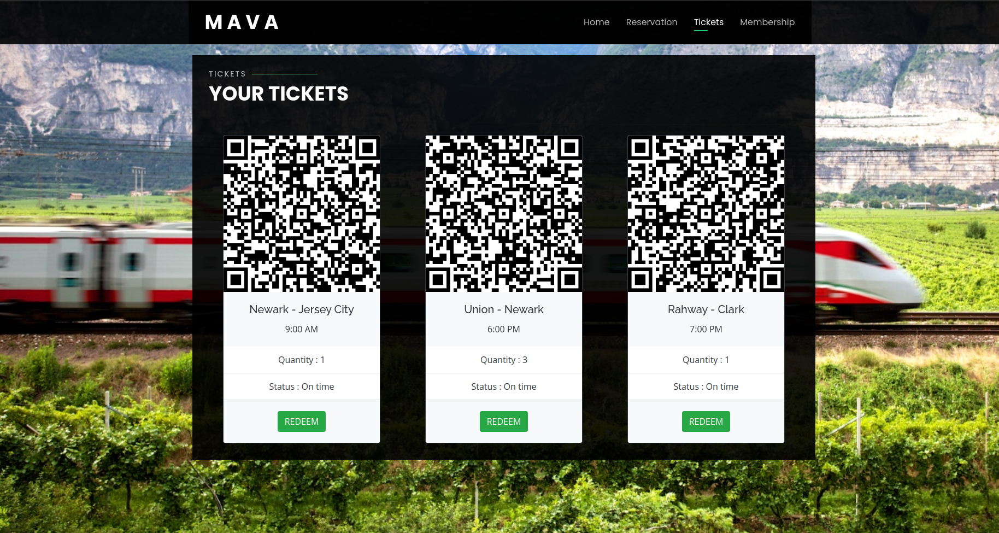

# Mava
May 2020
Read me before you start:
Mava wanted to make website where your everyday train rider will be able to use to make easier and stress free. Life is very complicated, and it come with some surprises, while using our website will alleviate the stress to able to buy tickets on the go without having to worry about lines at a ticket booth or having to pay extra for purchasing tickets with the train conductor.
	With Mava making an account would be the easiest and quickest to get the tickets that you want. We would ask you to provide basic information like your name, address and ect. When it comes to the purchase of tickets, we would like you to add a form of payment, credit/debt card. Once all the information is added you are welcome to start exploring the site options to buy tickets from the origin station to the destination you would like to get to, we will be showing the times and available tickets.

  

#
•	With address provided we will give you the closest station near the address provide, though you may choose the station closer to your current location  
•	Once decided on where you are coming from and where you would like to go, choose exactly what day and time you want choose with the provided drop down boxes   
•	tickets you would like to purchase, there is a limited amount of tickets to purchase from for each time and destinations   

#
•	Once ticket has been successfully purchased an email confirmation will be sent with ticket attached  
•	Once on train with ticket on hand the conductor will go through the train either collecting or scanning tickets to verify tickets purchased  
•	Tickets purchased through Mava are non-refundable         

## Checkout the website:
# https://aldwinrodriguez.github.io/MAVA/
 
